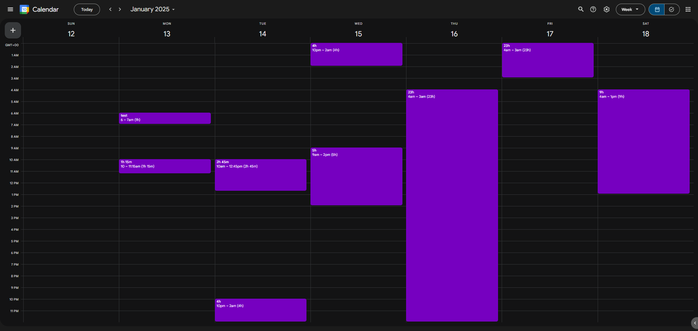

# Google Calendar Duration Extension

This browser extension enhances [Google Calendar](https://calendar.google.com/) by displaying the duration of events directly within the calendar interface.

## Installation and Usage

1. Clone the repository or download the source code.
2. Load the extension in your browser:
   - Open Chrome and navigate to `chrome://extensions/`.
   - Enable "Developer mode" by clicking the toggle switch in the top right corner.
   - Click the "Load unpacked" button and select the directory containing the extension's source code.
3. Open [Google Calendar](https://calendar.google.com/).
4. Event durations will be calculated and displayed next to the event times.